# Бот-переводчик в Telegram на Go
### Введение
Привет! Сегодня мы создадим бота-переводчика для Telegram. Для этого будем использовать библиотеку `telego` и нейросеть Mistral через платформу n8n.

### Подготовка к работе
1. Создаем папку для проекта и открываем ее в терминале
2. Инициализируем Go-модуль:
```shell
go mod init bot-translate
```
3. Устанавливаем необходимые библиотеки:
```shell
go get github.com/mymmrac/telego
```
4. Создаем файл `main.go` для основного кода бота

Для n8n отлично подойдет хостинг [Amvera Cloud](https://cloud.amvera.ru). Регистрируемся и получаем 111₽ на тестирование. 

Идем в раздел "Преднастроенные сервисы" затем "Создать преднастроенный сервис". Вводим название проекта и выбираем тариф, в моем случае будет тариф "Начальный Плюс". При создании нам предложат настроить конфигурацию, но я оставлю так как есть. Нажимаем "Завершить" и ждем когда приложение получит статус запущенного. После запуска переходим во вкладку "Домены". Создаем бесплатное доменное имя Amvera и выбираем тип подключения `https`. В дополнительных настройках пути и порта выбираем как на скриншоте:

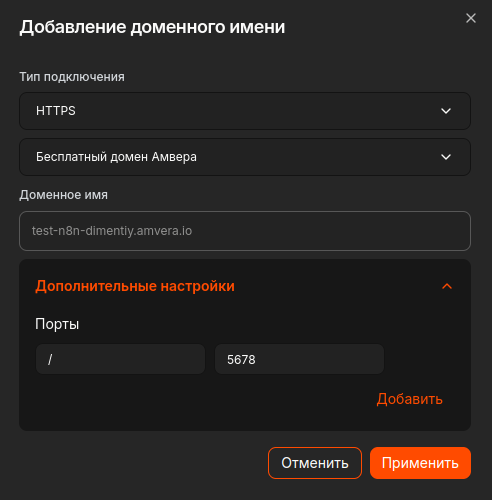

Переходим по созданному домену и регистрируем аккаунт владельца (email, имя, пароль). 

Первым делом нам надо подключить Mistral. В меню создаем новый Credential → Mist API. Получаем API-токен на [официальном сайте Mistral](https://mistral.ai). В настроках вводим полученый токен, а регион можно оставить Европейским. 

После подключения создаем новый Workflow. Первым шагом (Add first step) добавляем триггер "On webhook call"

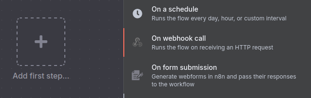

И вводим следующие данные:
   - HTTP Method: POST
   - Path: `/translate`

В Workflow добавляем шаг (плюсик идущий от вебхука) AI → "AI Agent" 

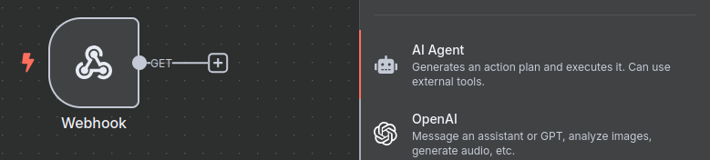

И указываем:
   - Source for Prompt: Define below
   - Prompt: `{{ $json.body.text }}`
   - Respond: Using 'Respond to Webhook' Node

Подключаем модель к агенту (плюсик у Chat Model → Mistral Cloud Chat Model):
   - Выбираем созданный Credential
   - Модель: mistral-large2411

Последним шагом добавляем Respond to Webhook (плюсик от агента → Core → в самом низу Respond to Webhook):
   - В Respond With вписываем - Text
   - А в Response Body - `{{ $json.output }}`

Примерно вот так будет выглядеть Workflow:

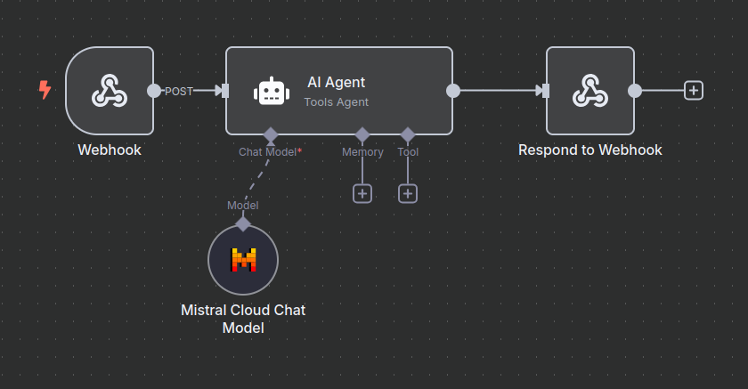

Осталось создать аккаунт бота.
1. Находим @BotFather в Telegram
2. Вводим команду `/newbot`
3. Указываем:
   - Имя бота (например, "Переводчик")
   - Юзернейм, например `translate_golang_bot` (должен заканчиваться на `bot`)
4. Сохраняем полученный токен

Теперь у нас есть все компоненты для создания бота.

### Пишем бота
Открываем файл `main.go`. Первым делом импортируем все необходимые зависимости:

```golang
package main
import (
	"context"
	"fmt"
	"net/http"
	"bytes"
	"time"
	"io"
	"strings"

	"github.com/mymmrac/telego"
	th "github.com/mymmrac/telego/telegohandler"
	tu "github.com/mymmrac/telego/telegoutil"
)
```

Создаем основную функцию и инициализируем переменные:
```golang
func main() {
	ctx := context.Background()
	bot, _ := telego.NewBot("TOKEN")
	updates, _ := bot.UpdatesViaLongPolling(ctx, nil)
	bh, _ := th.NewBotHandler(bot, updates)
	fmt.Print("Бот запущен!") // Уведомление об успешном запуске
}
```

Теперь добавим обработчики команд. Начнем с команды `/start`:
```golang
	bh.Handle(func(ctx *th.Context, update telego.Update) error {
		_, _ = ctx.Bot().SendMessage(ctx, tu.Message(tu.ID(update.Message.Chat.ID), 
			"Привет! Я бот-переводчик, написанный на Golang."))
		return nil
	}, th.CommandEqual("start"))
```

Основная функциональность реализована в команде `/translate`:
```golang
	bh.Handle(func(ctx *th.Context, update telego.Update) error {
		args := strings.SplitN(update.Message.Text, " ", 3)
		if len(args) < 3 {
			_, _ = ctx.Bot().SendMessage(ctx, 
				tu.Message(tu.ID(update.Message.Chat.ID), 
					"Использование: /translate <язык> <текст>"))
			return nil
		}

		language := args[1]
		text := args[2]

		req, _ := http.NewRequest("POST", "https://0.0.0.0:5678/webhook/translate", // Локальный хост используется только для разработки
			bytes.NewBufferString(fmt.Sprintf(`{"text":"Переведи на %s язык: %s. Строго без контекста"}`, language, text)))
		req.Header.Set("Content-Type", "application/json")
		client := &http.Client{Timeout: 10 * time.Second}
		resp, _ := client.Do(req)
		defer resp.Body.Close()

		body, _ := io.ReadAll(resp.Body)
		_, _ = ctx.Bot().SendMessage(ctx, tu.Message(tu.ID(update.Message.Chat.ID), string(body)))
		return nil
	}, th.CommandEqual("translate"))
```

Итоговый вариант файла `main.go`:
```golang
package main
import (
	"context"
	"fmt"
	"net/http"
	"bytes"
	"time"
	"io"
	"strings"

	"github.com/mymmrac/telego"
	th "github.com/mymmrac/telego/telegohandler"
	tu "github.com/mymmrac/telego/telegoutil"
)

func main() {
	ctx := context.Background()
	bot, _ := telego.NewBot(TOKEN)
	updates, _ := bot.UpdatesViaLongPolling(ctx, nil)
	bh, _ := th.NewBotHandler(bot, updates)
	fmt.Print("Бот запущен!")

	defer func() { _ = bh.Stop() }()

	bh.Handle(func(ctx *th.Context, update telego.Update) error {
		_, _ = ctx.Bot().SendMessage(ctx, tu.Message(tu.ID(update.Message.Chat.ID), 
			"Привет! Я бот-переводчик, написанный на Golang."))
		return nil
	}, th.CommandEqual("start"))

	bh.Handle(func(ctx *th.Context, update telego.Update) error {
		args := strings.SplitN(update.Message.Text, " ", 3)
		if len(args) < 3 {
			_, _ = ctx.Bot().SendMessage(ctx, 
				tu.Message(tu.ID(update.Message.Chat.ID), 
					"Использование: /translate <язык> <текст>"))
			return nil
		}

		language := args[1]
		text := args[2]

		req, _ := http.NewRequest("POST", "https://0.0.0.0:5678/webhook/translate",
			bytes.NewBufferString(fmt.Sprintf(`{"text":"Переведи на %s язык: %s. Строго без контекста"}`, language, text)))
		req.Header.Set("Content-Type", "application/json")
		client := &http.Client{Timeout: 10 * time.Second}
		resp, _ := client.Do(req)
		defer resp.Body.Close()

		body, _ := io.ReadAll(resp.Body)
		_, _ = ctx.Bot().SendMessage(ctx, tu.Message(tu.ID(update.Message.Chat.ID), string(body)))
		return nil
	}, th.CommandEqual("translate"))
	bh.Start()
}
```
### Запуск бота локально
Перед запуском бота на локальном компьютере необходимо настроить переадресацию запросов к вашему n8n серверу. Для этого замените адрес локального хоста в коде.

Исходная строка:
```golang
req, _ := http.NewRequest("POST", "https://0.0.0.0:5678/webhook/translate",
```

Замените на:
```golang
req, _ := http.NewRequest("POST", "https://<ваш-домен>/webhook/translate",
```

**Далее:**
1. Сохраните изменения в файле `main.go`
2. Откройте терминал в папке с проектом
3. Выполните команду запуска:
```bash
go run main.go
```
### Деплой
Деплоить мы все на тот же Amvera Cloud. Для этого в разделе Приложения нажимаем создать приложение. Вводим название и выбираем тариф. Далее загружаем файлы нашего бота, а именно: go.mod, go.sum, main.go. После загрузки файлов нам потребуется создать секрет TOKEN где будет храниться токен от бота. Это создано для безопасности. Для этого нажимаем Создать секрет. В поле названия пишем TOKEN  в значение указываем токен. 

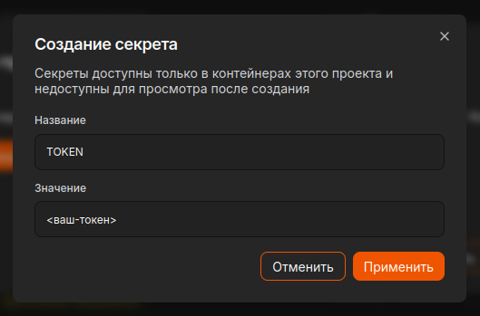

Теперь осталось создать файл конфигурации. Для этого выбираем все как на скриншоте:

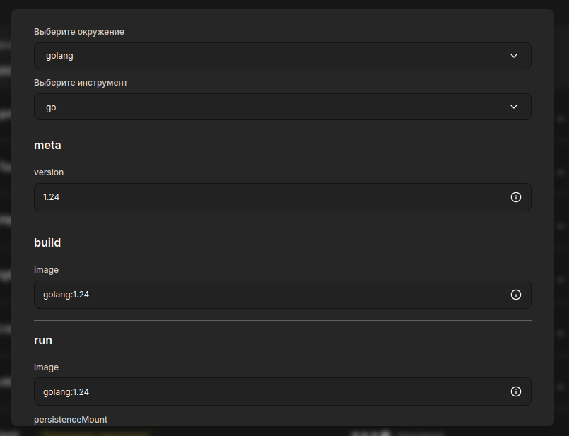

Нажимаем Завершить и ждем окончания сборки приложения. После упешной сборки, приложение начнет запускаться. 

Поздравляю! Наше приложение перешло в статус запущенного:

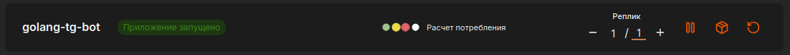

### Результат
1. **Стартовая команда**

   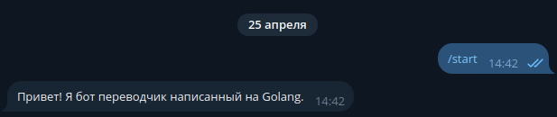

2. **Перевод текста**

   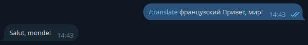

   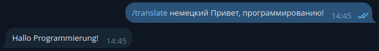

   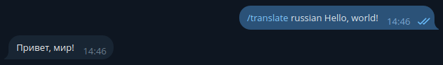

3. **Обработка ошибок**

   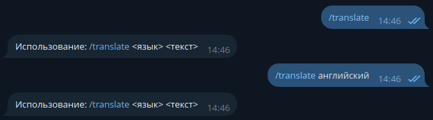

**Особенности работы:**
- Бот поддерживает перевод на все основные языки
- Сообщения обрабатываются в течение 2-3 секунд
- При ошибках соединения бот автоматически пытается восстановить связь
- Логи всех операций доступны в панели управления Amvera Cloud